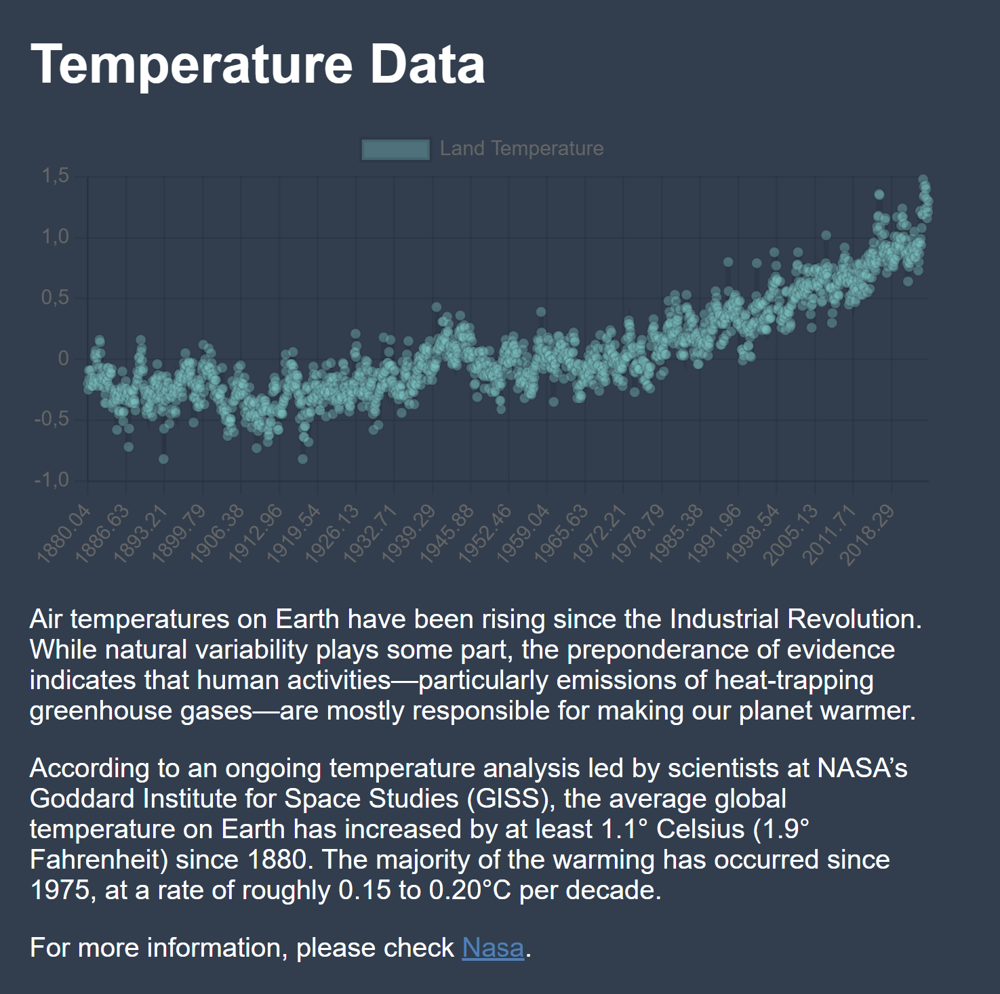

# Global Warming

A multi-page web application built with React that visualizes global warming data using various APIs. The app provides a simple and responsive dashboard with graphs showcasing temperature changes, CO2 levels, methane emissions, NO2 emissions, and polar ice extent.


## Features

- Multi-page navigation: The application includes several pages that display data related to global warming, such as temperature trends, CO2, methane, NO2, and polar ice data.
- API Integration: Fetches data from the Global Warming API.
- Responsive design: Designed to work across all device sizes.
- Charts and Graphs: Uses chart libraries to visualize data in a clear and interactive manner.
- Simple UI/UX: An organized, easy-to-navigate interface for users to access the data.

## Pages

1. Home - Introduction to global warming and links to different data categories.
2. Temperature - Displays global temperature changes over time.
3. CO2 - Visualizes CO2 levels across the years.
4. Methane - Shows data for methane emissions.
5. NO2 - Provides data for nitrous oxide emissions.
6. Polar Ice - Displays the extent of polar ice over time.

## Gettin Started

Follow these steps to set up the project locally.

### Prerequisites

Node.js and npm installed. You can download and install them from here([here](https://nodejs.org/en/download/package-manager)).

### Installation

1. Clone the repository:
```git clone https://github.com/yourusername/global-warming-dashboard.git```
```cd global-warming-dashboard```
2. Install dependencies:
```npm install```

### Running the Application

Start the development server:
```npm start```

This will start the app locally at http://localhost:3000.

### Build for Production

To build the project for production:
```npm run build```

This will create a production-ready build of the app in the ```build``` folder.

## API Endpoints

The app fetches data from the following APIs:

- Temperature: https://global-warming.org/api/temperature-api
- CO2: https://global-warming.org/api/co2-api
- Methane: https://global-warming.org/api/methane-api
- NO2: https://global-warming.org/api/nitrous-oxide-api
- Polar Ice: https://global-warming.org/api/arctic-api

## Deployment

To deploy on GitHub Pages:

1. Install gh-pages:

```npm install gh-pages --save-dev```

2. Add the following to package.json:

```"homepage": "https://yourusername.github.io/global-warming-dashboard",```
```"scripts": {```
 ``` "predeploy": "npm run build",```
 ``` "deploy": "gh-pages -d build"```
```}```

3. Deploy the app:

```npm run deploy```

## Credits
Data provided by Global Warming API.
Background information from National Geographic, Nasa and EPA.